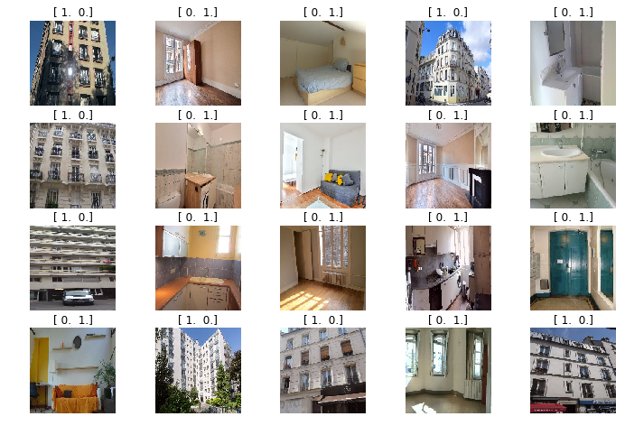

# Image Classifier with Tensorflow and Keras

This is a Jupyter notebook with example of training an Image Classifier when there are only few training samples.

Training images are the photos of either exterior or interior of the buildings. Image Classifier should discriminate between these 2 classes.

Feel free to open [Image Classifier code notebook](image-classifier-with-tensorflow.ipynb) to check the details about the code.


## Notebook Content
- Build custom Convolutional Neural Network 
- Use Data Augmentation to generate more training images
- Use Transfer Learning to build VGG16-based ConvNet

## Dataset
All images are organized inside `data` directory in train and validation sets. Inside each set there are subdirectories according to the classes, like in the schema below:

```
./data/
	train/
		facade/
			img1.jpg
			img2.jpg
			...
		flat/
			img1.jpg
			img2.jpg
			...
	val-custom/		
		facade/
			img1.jpg
			img2.jpg
			...
		flat/
			img1.jpg
			img2.jpg
			...
```

## Example
Below is a sample of training images and there labels (in '1-hot-encoded' form):



## Requirements
This notebook was tested in the following environment:

- Python 3.6
- Numpy 1.13.3
- Keras 2.0.8
- Tensorflow 1.3
- Matplotlib 2.0.2

----
Alexander Usoltsev, 2017
